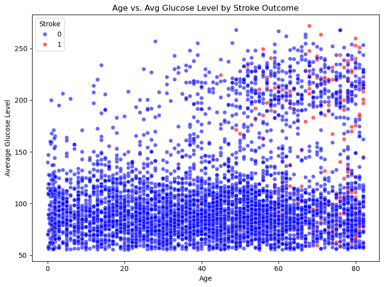
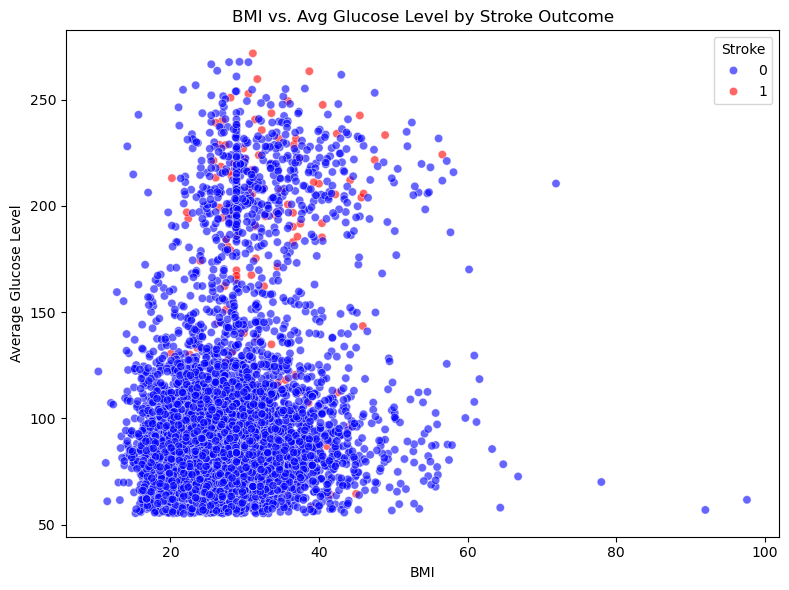
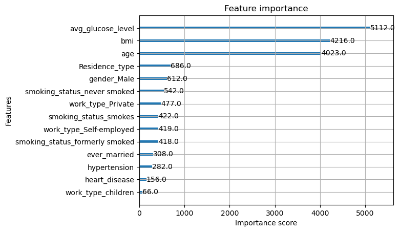
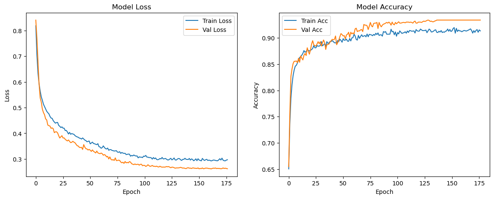
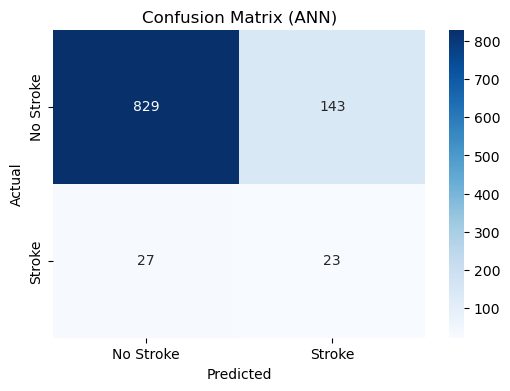
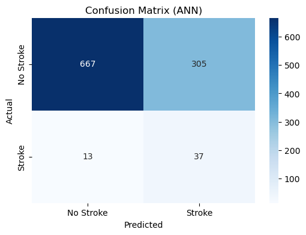

# Stroke Data Analysis and Prediction with Machine Learning and Deep Learning Approach

This project explores stroke prediction using a healthcare dataset and compares multiple machine learning and deep learning approaches. The goal is to build a predictive model that identifies patients at higher risk of stroke based on demographic and health-related features.

The dataset is inherently imbalanced, stroke cases are rare compared to non-stroke cases therefore special attention is given to class balancing and evaluation metrics beyond simple accuracy.

---

## Overview

The dataset contains records of individuals with attributes such as:
- age
- gender
- hypertension
- heart disease
- average glucose level
- body mass index (BMI)
- marital status
- residence type
- work type
- and smoking status

The target variable is a binary label indicating whether the person experienced a stroke.  

Because stroke is relatively rare, a naive model that predicts “no stroke” for everyone would achieve high accuracy but be clinically useless. To address this, the project focuses on metrics such as recall, F1-score, and the area under the precision–recall curve (AUC-PR).

---

## Data Preparation

The raw dataset (`healthcare-dataset-stroke-data-raw.csv`) required several cleaning steps. Missing BMI values were replaced with the mean, and the unique identifier column was dropped. Categorical features such as gender, work type, residence type, and smoking status were encoded using a combination of label encoding and one-hot encoding to ensure that models could interpret these variables.

Because of the class imbalance, the training set was augmented using SMOTE (Synthetic Minority Over-sampling Technique). SMOTE was applied only to the training partition to avoid information leakage. The features were then standardized with a `StandardScaler` to ensure that algorithms sensitive to scale, such as SVM and neural networks, performed optimally.

---

## Modeling Approach

Several models were trained and compared:

* **Support Vector Machine (SVM)**: Tuned with a grid search over C, gamma, and kernel types. The default decision threshold of 0.5 was used, as SVM outputs binary predictions by default.
* **XGBoost**: A powerful gradient boosting method particularly suited for imbalanced datasets. Optimized threshold based from precision-recall curve is used.
* **Artificial Neural Network (ANN)**: A neural network with 4 hidden layers, dropout for regularization, and an adaptive learning rate scheduler. Like XGBoost, the ANN benefits from a custom probability threshold rather than the default 0.5. There are 2 values of threshold that were used, optimized and custom.

Each model was evaluated using a separate test set that had not been oversampled.

---

## Visualization

Before modeling, simple scatter plots highlight how challenging it is to separate classes in two dimensions.

  
*Age vs. average glucose level by stroke outcome.*

  
*BMI vs. average glucose level by stroke outcome.*

The heavy overlap demonstrates why linear separability is not feasible and motivates the need for more complex models.

---

## Methodology, Results, and Discussion

### Data Preparation  
The project began with loading the raw dataset (`healthcare-dataset-stroke-data-raw.csv`).  
Several preprocessing steps were essential before modeling:

* **Encoding & Cleaning** – Categorical features such as gender, work type, and smoking status were one-hot encoded.  
* **Dropping Unused Columns** – Columns with unique identifiers (e.g., patient ID) provided no predictive power and were removed.  
* **Handling Missing Values** – The column `bmi` contained 201 missing entries. These were imputed with the median BMI so that the overall distribution was preserved.

### Initial Exploration  
To understand relationships among key health indicators, we plotted BMI against average glucose level, and age against average glucose level in the **Visualization** part.

The scatter plot reveals heavy overlap between stroke and non-stroke patients, confirming that the dataset is **difficult to separate in a 2-D space**.

Another critical finding was **class imbalance**:

| Outcome   | Count |
|-----------|------:|
| No Stroke | 3,889 |
| Stroke    |   199 |

This imbalance required handling otherwise most models would simply predict “No Stroke” for everyone.

### Balancing the Data with SMOTE  
To address the imbalance, **Synthetic Minority Oversampling Technique (SMOTE)** was applied to the training set:

| Outcome   | Before | After |
|-----------|------:|------:|
| No Stroke | 3,889 | 3,889 |
| Stroke    |   199 | 3,889 |

SMOTE creates synthetic minority samples, giving the models a more balanced view during training. However, as the result later, SMOTE itself is not sufficient. The dataset itself should be improved.

---

### Support Vector Machine (SVM)  
Our first model was the SVM. We explored multiple kernels, C, and gamma values:

| C     | Gamma | Kernel   |
|------:|------:|---------|
| 0.1   | 0.001 | rbf / poly / sigmoid |
| 1     | 0.01  | rbf / poly / sigmoid |
| 10    | 0.1   | rbf / poly / sigmoid |
| 100   | 1     | rbf / poly / sigmoid |

**Best Parameters:**  
`{'C': 100, 'class_weight': 'balanced', 'gamma': 1, 'kernel': 'rbf'}`  
**Best CV F1:** 0.94

**Test Results**

| Metric      | No Stroke | Stroke |
|-------------|---------:|------:|
| Precision   | 0.95     | 0.03 |
| Recall      | 0.92     | 0.04 |
| F1-score    | 0.94     | 0.03 |

*Accuracy: 0.88*  

Although overall accuracy looked strong, the **recall for stroke was only 4%**, meaning the model almost never caught positive cases, an unacceptable result in a medical context.

---

### XGBoost  
Gradient boosting is often more powerful than traditional SVMs. We performed a grid search across:

| max_depth | learning_rate | n_estimators | subsample | colsample_bytree |
|----------:|--------------:|------------:|---------:|-----------------:|
| 3, 5, 7   | 0.01, 0.1, 0.2| 100, 300, 500 | 0.8, 1.0 | 0.8, 1.0 |

**Best Parameters:**  
`{'colsample_bytree': 0.8, 'learning_rate': 0.1, 'max_depth': 7, 'n_estimators': 500, 'subsample': 0.8}`  
**Best CV F1:** 0.97

*Default Threshold (0.5)*  
Accuracy: **0.95**, but **recall for stroke was 0%**.

Using a **Precision–Recall curve** to lower the threshold (≈ 0.000088):

| Metric      | No Stroke | Stroke |
|-------------|---------:|------:|
| Precision   | 0.96     | 0.13 |
| Recall      | 0.95     | 0.16 |
| F1-score    | 0.95     | 0.15 |

Accuracy dropped slightly to **0.91**, but recall improved, showing the value of custom thresholds.

Feature importance analysis highlighted the top contributors:

* **Average Glucose Level – 5112.0**  
* **BMI – 4216.0**  
* **Age – 4023.0**

---

### Deep Neural Network (ANN)  
To further improve performance, we built a **4-hidden-layer neural network** with L2 regularization, Dropout, and learning-rate scheduling.

* Learning rate: **0.0001**  
* Batch size: **64**  
* Early stopping and ReduceLROnPlateau used.

Training history:

A precision–recall search gave a **best threshold of 0.0946**:

| Metric      | No Stroke | Stroke |
|-------------|---------:|------:|
| Precision   | 0.98     | 0.12 |
| Recall      | 0.75     | 0.68 |
| F1-score    | 0.85     | 0.21 |

Accuracy: **0.75**  

Lowering the threshold to **0.05** to favor recall:

| Metric      | No Stroke | Stroke |
|-------------|---------:|------:|
| Precision   | 0.98     | 0.11 |
| Recall      | 0.69     | 0.74 |
| F1-score    | 0.81     | 0.19 |

Accuracy decreased to **0.69**, but **stroke recall rose to 74%**.

---

### Key Takeaways  
This project demonstrates the importance of class-imbalance handling, probability threshold adjustment, and evaluation beyond accuracy when working with medical prediction tasks.

* **Dataset Quality Matters** – Even advanced models struggle when the underlying data is extremely imbalanced.  
* **SMOTE Helps to Some Extend** – Balancing the data improved recall but could not fully solve the issue.  
* **Top Predictors** – Average glucose level, BMI, and age are the strongest indicators of stroke risk.  
* **Threshold Tuning Is Critical** – In medical contexts, catching more true positives (higher recall) is often worth the cost of more false positives.

Comparing models:

| Model      | Best Accuracy | Stroke Recall (after tuning) |
|------------|-------------:|----------------------------:|
| SVM        | 0.88         | 0.04 |
| XGBoost    | 0.91         | 0.16 |
| ANN        | 0.69–0.75    | 0.68–0.74 |

The **neural network** offered the best balance of recall and precision for stroke detection, even at the cost of overall accuracy and compute power. A trade-off more appropriate for healthcare screening.

---

**Notebook & Data**  
* Full notebook: [python/stroke_prediction_rev2.ipynb](python/stroke_prediction_rev2.ipynb)  
* Raw data: [healthcare-dataset-stroke-data-raw.csv](healthcare-dataset-stroke-data-raw.csv)

---

## Reproducibility

All code and analysis can be found in the Jupyter notebook in Github:
*[Github](https://github.com/tammahasya/stroke-analysis-and-prediction.git)

* [`python/stroke_prediction_rev2.ipynb`](python/stroke_prediction_rev2.ipynb)

The raw dataset used for this project is included:

* [`healthcare-dataset-stroke-data-raw.csv`](healthcare-dataset-stroke-data-raw.csv)

Clone the repository and open the notebook to reproduce the analysis or adapt the models to other healthcare datasets.

---

## License
This project is licensed under the [MIT License](LICENSE).
